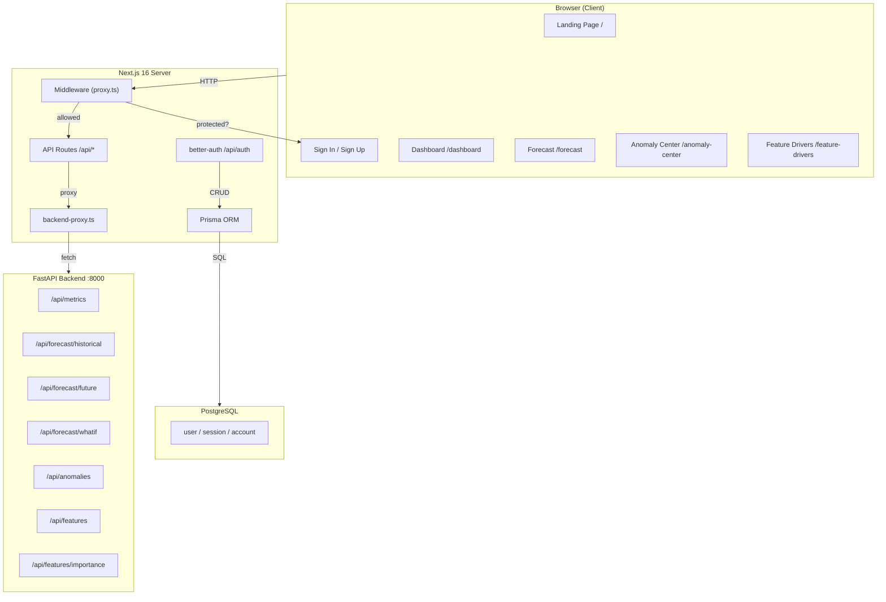
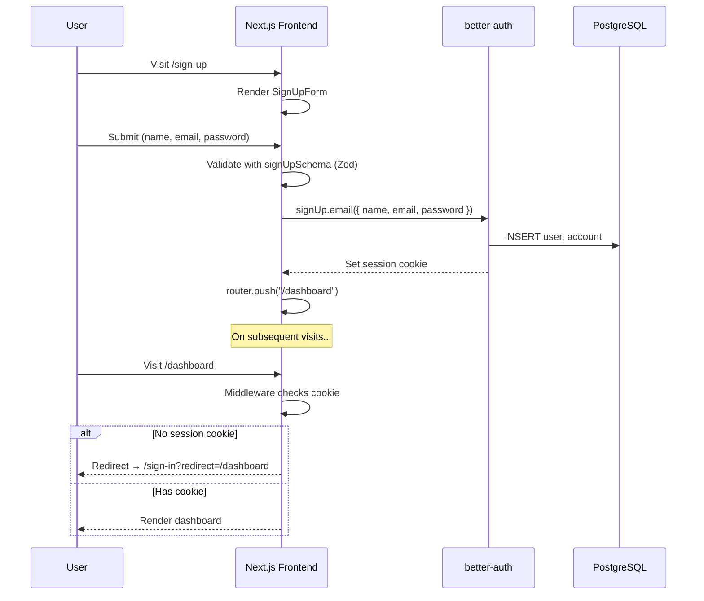
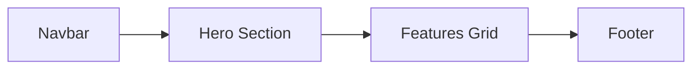
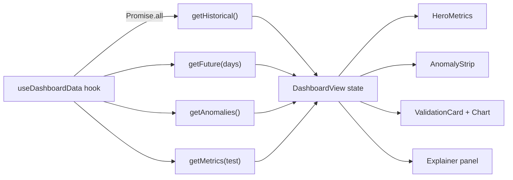
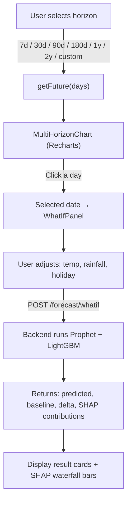
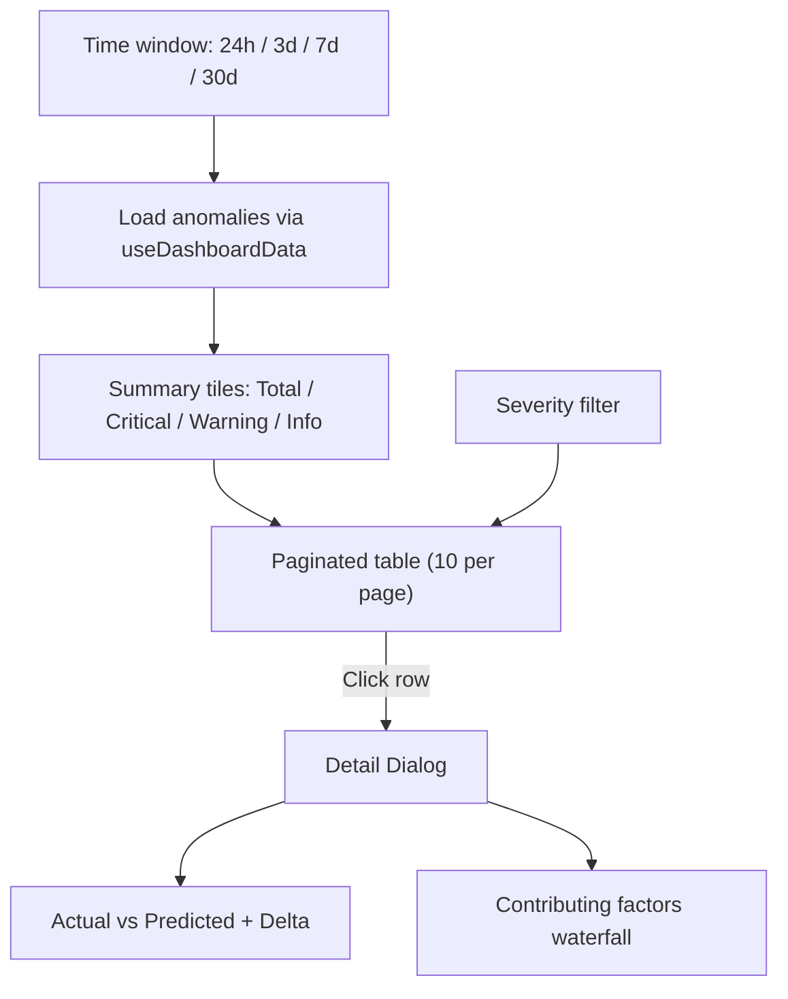
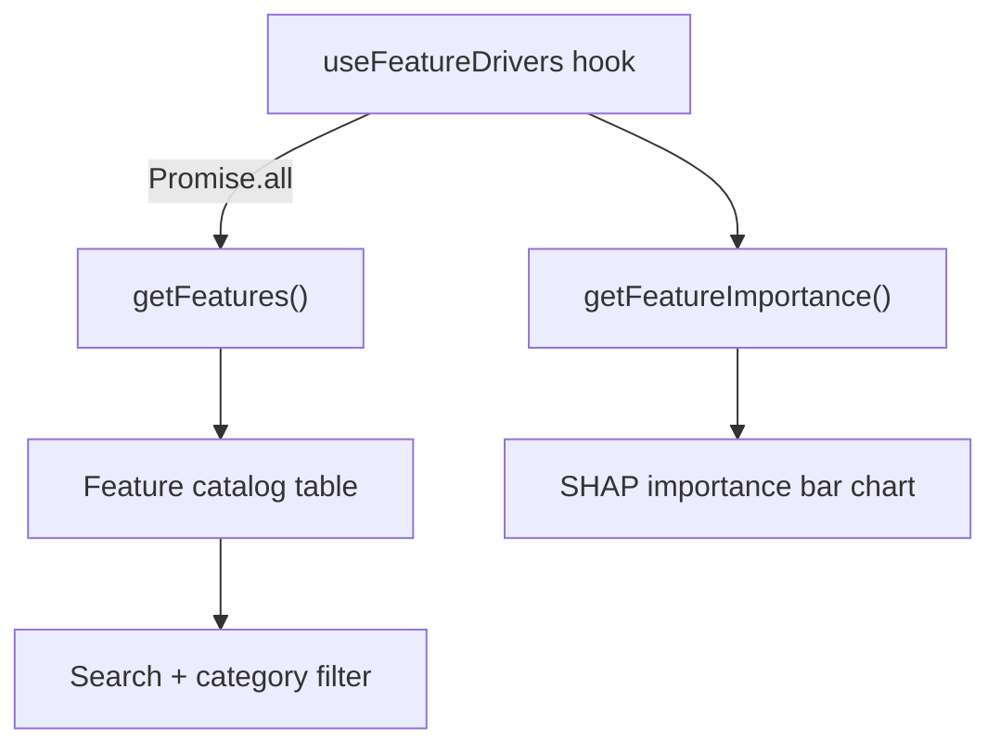
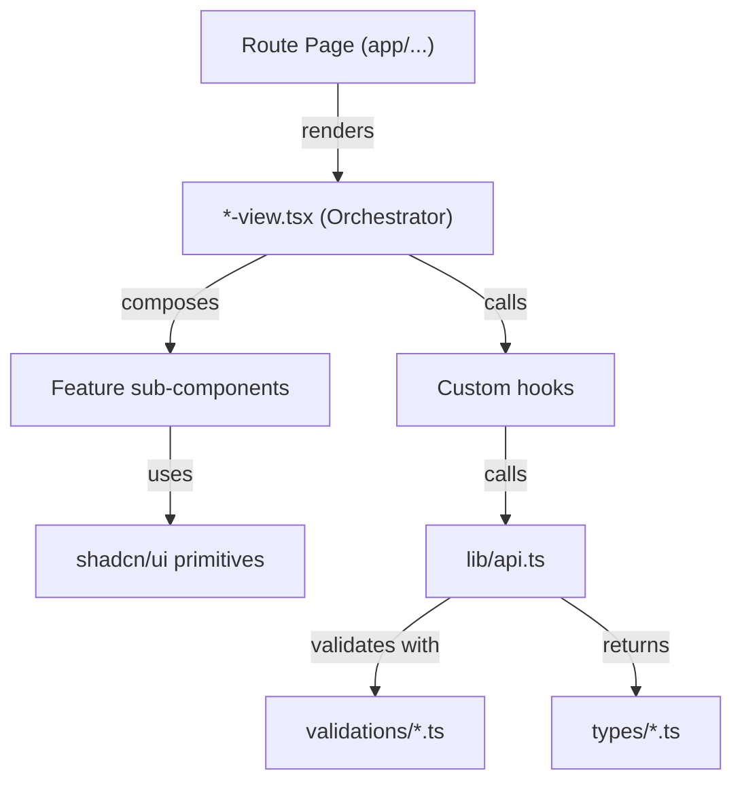
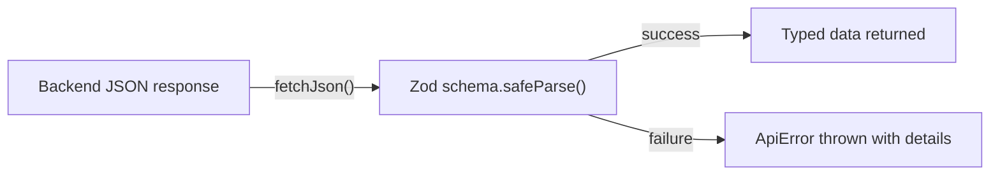
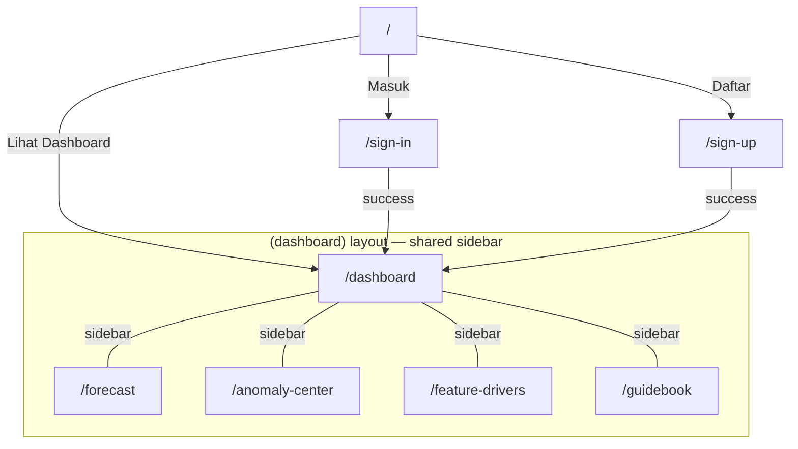

# 📘 Castricity — Application Guidebook

> **Castricity** is an AI-powered electricity demand forecasting platform built with Next.js 16, React 19, and a Python FastAPI backend. It provides an operational dashboard, multi-horizon forecasting, anomaly detection, and explainable AI (XAI) capabilities for modern power grid management.

---

## Table of Contents

1. [Technology Stack](#1-technology-stack)
2. [Project Structure](#2-project-structure)
3. [Architecture Overview](#3-architecture-overview)
4. [Authentication Flow](#4-authentication-flow)
5. [Data Flow & API Proxy](#5-data-flow--api-proxy)
6. [Feature Modules](#6-feature-modules)
7. [Component Architecture](#7-component-architecture)
8. [Custom Hooks](#8-custom-hooks)
9. [Type System & Validation](#9-type-system--validation)
10. [Theming & Design System](#10-theming--design-system)
11. [Navigation Map](#11-navigation-map)

---

## 1. Technology Stack

| Layer | Technology | Version |
|-------|-----------|---------|
| Framework | Next.js (App Router + Turbopack) | 16.2.6 |
| UI Library | React | 19.2.4 |
| Language | TypeScript | 5.x |
| Styling | Tailwind CSS v4 + `tw-animate-css` | 4.x |
| UI Primitives | shadcn/ui + Radix UI | 4.7.0 |
| Charts | Recharts (+ hand-rolled SVG) | 3.8.0 |
| Auth | better-auth (email + password) | 1.6.11 |
| Database | PostgreSQL via Prisma ORM | 7.8.0 |
| Validation | Zod | 4.4.3 |
| Backend | Python FastAPI (separate repo) | — |
| Package Manager | pnpm | — |

---

## 2. Project Structure

```
Castricity-Frontend/
├── prisma/
│   └── schema.prisma          # User, Session, Account, Verification models
├── src/
│   ├── app/                   # Next.js App Router
│   │   ├── layout.tsx         # Root layout (fonts, Toaster)
│   │   ├── page.tsx           # Landing page (/)
│   │   ├── globals.css        # Design tokens + dark theme
│   │   ├── sign-in/page.tsx   # Sign-in page
│   │   ├── sign-up/page.tsx   # Sign-up page
│   │   ├── (dashboard)/       # Route group — shared sidebar layout
│   │   │   ├── layout.tsx     # SidebarProvider + TooltipProvider
│   │   │   ├── dashboard/     # /dashboard
│   │   │   ├── forecast/      # /forecast
│   │   │   ├── anomaly-center/# /anomaly-center
│   │   │   └── feature-drivers/# /feature-drivers
│   │   └── api/               # Next.js API routes (proxy layer)
│   │       ├── auth/[...all]/ # better-auth catch-all
│   │       ├── metrics/       # GET → backend /api/metrics
│   │       ├── anomalies/     # GET → backend /api/anomalies
│   │       ├── forecast/      # historical, future, whatif
│   │       └── features/      # features, importance, required
│   ├── components/
│   │   ├── ui/                # 55 shadcn primitives (do NOT edit casually)
│   │   └── features/          # Feature-specific components
│   │       ├── landing/       # Navbar, Hero, Features, Footer, ShapeGrid
│   │       ├── auth/          # SignInForm, SignUpForm
│   │       ├── dashboard/     # DashboardView + 17 sub-components
│   │       ├── forecast/      # ForecastView, MultiHorizonChart, WhatIfPanel
│   │       ├── anomaly-center/# AnomalyCenterView, AnomalyChart
│   │       └── feature-drivers/# FeatureDriversView, ImportanceChart
│   ├── hooks/                 # 6 custom React hooks
│   ├── lib/                   # API client, auth, Prisma, helpers
│   │   ├── api.ts             # Typed fetch client with Zod validation
│   │   ├── auth.ts            # better-auth server config
│   │   ├── auth-client.ts     # better-auth React client
│   │   ├── backend-proxy.ts   # Server-side proxy to FastAPI
│   │   ├── prisma.ts          # Prisma singleton
│   │   └── dashboard/         # data.ts (series builder), format.ts
│   ├── types/                 # TypeScript interfaces
│   │   ├── api.ts             # Backend response shapes
│   │   ├── auth.ts            # SignIn/SignUp input types
│   │   └── dashboard.ts       # Domain types (Series, Metrics, etc.)
│   ├── validations/           # Zod schemas
│   │   ├── api.ts             # API response schemas
│   │   ├── auth.ts            # signInSchema, signUpSchema
│   │   └── dashboard.ts       # tweaks, regions, horizons
│   └── proxy.ts               # Middleware (route protection)
└── .env                       # Environment variables
```

---

## 3. Architecture Overview



### Key Architectural Decisions

1. **API Proxy Pattern** — The frontend never calls the Python backend directly. All `/api/*` routes in Next.js act as thin proxies via `backend-proxy.ts`, forwarding requests to `BACKEND_URL` (localhost:8000). This keeps the backend URL secret and allows server-side transformations.

2. **Route Group `(dashboard)`** — Parenthesized route group wraps all dashboard pages with a shared layout containing `SidebarProvider`, `TooltipProvider`, and the navigation sidebar without adding a URL segment.

3. **Layered Separation** — Strict split: `types/` → `validations/` → `lib/` → `hooks/` → `components/features/` → `app/` pages. Each feature follows this pipeline.

4. **React Compiler** — `babel-plugin-react-compiler` is enabled, so manual `useMemo`/`useCallback` is avoided unless profiling demands it.

---

## 4. Authentication Flow



### Auth Components

| Component | File | Purpose |
|-----------|------|---------|
| `SignInForm` | `features/auth/sign-in-form.tsx` | Email + password login with Zod validation |
| `SignUpForm` | `features/auth/sign-up-form.tsx` | Registration with name, email, password |
| `Navbar` | `features/landing/navbar.tsx` | Session-aware: shows "Dashboard" if authed, "Sign In/Sign Up" if not |

### Middleware Route Protection

[proxy.ts](file:///c:/Rei/UC/FindIT/Castricity-Frontend/src/proxy.ts) protects `/dashboard` and `/predict` prefixes. If no `better-auth.session_token` cookie is found, the user is redirected to `/sign-in`. Conversely, authenticated users visiting `/sign-in` or `/sign-up` are redirected to `/dashboard`.

---

## 5. Data Flow & API Proxy

### Proxy Architecture

```
Browser → /api/metrics?split=test
       → Next.js API Route (route.ts)
       → proxyToBackend("/metrics?split=test")
       → fetch("http://localhost:8000/api/metrics?split=test")
       → Response piped back to browser
```

All API routes use `export const dynamic = "force-dynamic"` to bypass caching.

### API Client (`lib/api.ts`)

The typed API client provides these functions:

| Function | Endpoint | Returns |
|----------|----------|---------|
| `getMetrics(split?)` | `GET /metrics` | `Metrics` (MAE, RMSE, MAPE, R²) |
| `getHistorical(start?, end?)` | `GET /forecast/historical` | `HistoryPoint[]` |
| `getFuture(days?)` | `GET /forecast/future?days=N` | `ForecastPoint[]` |
| `getAnomalies()` | `GET /anomalies` | `AnomalyEntry[]` |
| `runWhatIf(payload)` | `POST /forecast/whatif` | `ApiWhatIfResult` (predicted, baseline, delta, SHAP) |
| `getFeatures()` | `GET /features` | `{ features[], total }` |
| `getRequiredFeatures()` | `GET /features/required` | `ApiFeatureInfo[]` |
| `getFeatureImportance()` | `GET /features/importance` | `ApiFeatureImportance[]` |

Every response is validated at runtime with Zod schemas from `validations/api.ts`. Invalid shapes throw `ApiError`.

---

## 6. Feature Modules

### 6.1 Landing Page (`/`)

The public marketing page. No authentication required.



- **Navbar** — Session-aware. Shows "Masuk / Daftar" for guests, "Pergi Dashboard" for authenticated users.
- **Hero** — Animated `ShapeGrid` background, CTA button linking to `/dashboard`.
- **Features** — Three cards: AI-Powered Forecasts, Anomaly Detection, Explainable AI.
- **Footer** — Product links + version badge.

### 6.2 Operations Dashboard (`/dashboard`)

The main control room. Orchestrated by [DashboardView](file:///c:/Rei/UC/FindIT/Castricity-Frontend/src/components/features/dashboard/dashboard-view.tsx).

**State managed by DashboardView:**

| State | Type | Purpose |
|-------|------|---------|
| `regionId` | `string` | Selected region (sys, north, metro, coast, inland) |
| `futureHours` | `ForecastHorizon` | 24 / 48 / 72 / 168 hours |
| `brush` | `[number, number]` | Normalized range for chart zoom |
| `explainPt` | `ExplainerPoint \| null` | Point selected for XAI explanation |
| `range` | `DateRange` | Calendar date filter |
| `tweaks` | `Tweaks` | UI preferences (accent, density, bands, error format) |

**Data pipeline:**



**Sub-components:**

| Component | Purpose |
|-----------|---------|
| `DashboardTopbar` | Region selector, live clock, refresh button |
| `HeroMetrics` | Peak demand tile + MAPE accuracy tile |
| `MetricTile` | Single KPI card with sparkline support |
| `AnomalyStrip` | Horizontal scrollable anomaly event badges |
| `ValidationCard` | Actual vs. predicted chart with date picker + brush |
| `ValidationChart` | Hand-rolled SVG time series (not Recharts) |
| `ForecastCard` | Future prediction chart with confidence bands |
| `ForecastChart` | Hand-rolled SVG forecast visualization |
| `Explainer` | XAI factor breakdown panel |
| `MetricsRow` | MAPE / RMSE / MAE / Bias / Hit row |

Auto-refresh is configured at **60-second intervals** via `useDashboardData`.

### 6.3 Multi-Horizon Forecast (`/forecast`)

Orchestrated by [ForecastView](file:///c:/Rei/UC/FindIT/Castricity-Frontend/src/components/features/forecast/forecast-view.tsx).

**Workflow:**



**What-If Panel parameters:**

| Parameter | Type | Description |
|-----------|------|-------------|
| `target_date` | Date | Day to simulate |
| `avg_temp` | number (°C) | Average temperature |
| `rainfall` | number (mm) | Rainfall amount |
| `is_holiday` | boolean | National holiday flag |

The response includes SHAP contribution factors displayed as horizontal waterfall bars, showing each feature's positive/negative impact on the prediction.

### 6.4 Anomaly Center (`/anomaly-center`)

Orchestrated by [AnomalyCenterView](file:///c:/Rei/UC/FindIT/Castricity-Frontend/src/components/features/anomaly-center/anomaly-center-view.tsx).

**Workflow:**



**Severity levels:**
- 🔴 **Critical** — Major demand deviations (e.g., heatwave events)
- 🟠 **Warning** — Moderate anomalies (e.g., solar generation drops)
- 🔵 **Info** — Minor deviations for awareness

Each anomaly entry contains: severity, title, asset, timestamp, actual value, predicted value, deviation percentage, and Isolation Forest score.

### 6.5 Feature Drivers (`/feature-drivers`)

Orchestrated by [FeatureDriversView](file:///c:/Rei/UC/FindIT/Castricity-Frontend/src/components/features/feature-drivers/feature-drivers-view.tsx).

**Workflow:**



**Feature categories:**

| Category | Badge Color | Examples |
|----------|------------|---------|
| Temporal | Purple | hour_of_day, day_of_week |
| Lag | Cyan | demand_lag_1d, demand_lag_7d |
| Rolling | Green | rolling_mean_7d, rolling_std_3d |
| Exogenous | Orange | avg_temp, rainfall, solar_irradiance |
| Categorical | Red | is_holiday, is_weekend |

Features are sorted by SHAP importance. The table shows: name, category badge, description, SHAP value bar, and whether it accepts user input.

---

## 7. Component Architecture

### Layered Component Pattern



### Adding a New Feature

Follow this pipeline:

1. **`src/types/<feature>.ts`** — Define TypeScript interfaces
2. **`src/validations/<feature>.ts`** — Create Zod schemas
3. **`src/lib/<feature>/`** — Data helpers and domain logic
4. **`src/hooks/use-<feature>.ts`** — React hook for data fetching
5. **`src/components/features/<feature>/`** — UI components with `*-view.tsx` orchestrator
6. **`src/app/(dashboard)/<feature>/page.tsx`** — Route page
7. **`src/app/api/<feature>/route.ts`** — API proxy route (if needed)
8. **Update sidebar** — Add nav item in `sidebar.tsx`

---

## 8. Custom Hooks

| Hook | File | Purpose |
|------|------|---------|
| `useDashboardData` | [use-dashboard-data.ts](file:///c:/Rei/UC/FindIT/Castricity-Frontend/src/hooks/use-dashboard-data.ts) | Fetches history, future, anomalies, metrics in parallel. Auto-refreshes every 60s. Returns `{ data, loading, refreshing, error, refresh }`. |
| `useFeatureDrivers` | [use-feature-drivers.ts](file:///c:/Rei/UC/FindIT/Castricity-Frontend/src/hooks/use-feature-drivers.ts) | Fetches feature list + SHAP importance. Returns `{ data, loading, refreshing, error, refresh }`. |
| `useTweaks` | [use-tweaks.ts](file:///c:/Rei/UC/FindIT/Castricity-Frontend/src/hooks/use-tweaks.ts) | Dashboard UI preferences (accent color, density, show bands, error format). Validated via Zod. |
| `useLiveClock` | [use-live-clock.ts](file:///c:/Rei/UC/FindIT/Castricity-Frontend/src/hooks/use-live-clock.ts) | Returns a `Date` that updates every 30 seconds for the topbar clock. |
| `useElementSize` | [use-element-size.ts](file:///c:/Rei/UC/FindIT/Castricity-Frontend/src/hooks/use-element-size.ts) | `ResizeObserver`-based hook for responsive SVG chart sizing. |
| `useIsMobile` | [use-mobile.ts](file:///c:/Rei/UC/FindIT/Castricity-Frontend/src/hooks/use-mobile.ts) | Media query hook (`<768px`). |

---

## 9. Type System & Validation

### Core Domain Types (`types/dashboard.ts`)

```typescript
HistoryPoint  { t: Date, actual: number, predicted: number, anomaly?: AnomalyKey }
ForecastPoint { t: Date, predicted: number, p10: number, p90: number }
Metrics       { mae, rmse, mape, bias, hit }
AnomalyEntry  { sev: Severity, title, asset, timeAgo, point: ExplainerPoint }
ExplainerData { title, sev, desc, factors: ExplainerFactor[] }
Tweaks        { accent, density, showBand, showHistoryOnForecast, errorAsPct }
```

### Zod Validation Pipeline



Every API response is validated at runtime. This catches backend contract changes early. Schemas live in `validations/api.ts` and mirror the `types/api.ts` interfaces.

---

## 10. Theming & Design System

The app uses a **single dark "control-room" palette** defined in [globals.css](file:///c:/Rei/UC/FindIT/Castricity-Frontend/src/app/globals.css).

### Custom Design Tokens

| Token | Value | Usage |
|-------|-------|-------|
| `--accent-cyan` | `#06B6D4` | Primary accent, forecast lines |
| `--accent-green` | `#10B981` | Positive indicators, accuracy |
| `--accent-orange` | `#F59E0B` | Warning severity |
| `--accent-red` | `#EF4444` | Critical severity, negative deltas |
| `--accent-purple` | `#8B5CF6` | XAI / feature drivers accent |
| `--text-secondary` | `#94A3B8` | Secondary text |
| `--text-muted` | `#64748B` | Muted labels |
| `--text-faint` | `#475569` | Barely visible text |

### CSS Utility Classes

| Class | Purpose |
|-------|---------|
| `.mono` | Monospace font for numbers/codes |
| `.pulse-dot` | Animated green pulsing dot (live indicator) |
| `.pulse-dot-red` | Red variant for alerts |

### Usage Convention

Use Tailwind utilities with tokens: `text-accent-cyan`, `bg-accent-red/15`, `text-text-muted` — never inline hex values.

---

## 11. Navigation Map



### Sidebar Navigation Structure

| Group | Item | Route | Icon |
|-------|------|-------|------|
| Operasi | Dashboard | `/dashboard` | LayoutGrid |
| Operasi | Forecast | `/forecast` | LineChart |
| Operasi | Anomaly center | `/anomaly-center` | AlertTriangle |
| Data | Feature drivers | `/feature-drivers` | Workflow |
| Sistem | Panduan | `/guidebook` | BookOpen |

---

> **Last updated:** 2026-05-14 · **Version:** v2.4.1 · **Build:** a17f3
